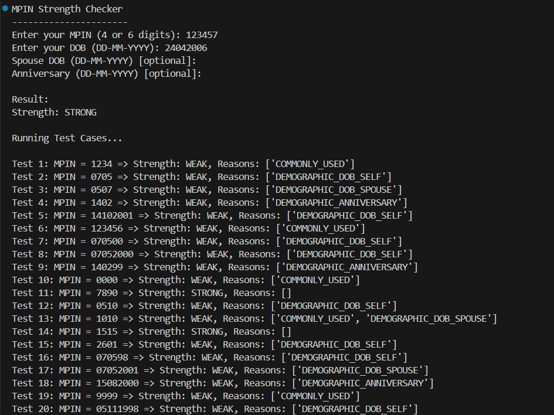

# 🔐 MPIN Strength Checker



This project is a simple Python-based tool that checks whether your MPIN (Mobile PIN used for banking apps) is **strong** or **weak** based on commonly used patterns and personal information.

## 📘 Background

Many people use weak MPINs like:
- `1234`, `0000`, `1111` (common patterns)
- Birth dates or anniversaries like `0705`, `1402`, `050798` etc.

These can be **easily guessed**, making the MPIN unsafe.  
This program checks if your MPIN is vulnerable using:
- Common MPIN patterns
- Your Date of Birth
- Spouse's Date of Birth (optional)
- Wedding Anniversary (optional)

---

## 🛠️ Features

✅ Accepts **4-digit or 6-digit MPINs**  
✅ Checks against a list of **commonly used PINs**  
✅ Compares with possible combinations from:
- Your **DOB**
- **Spouse's DOB**
- **Anniversary**

✅ Gives **reason** if MPIN is weak  
✅ Includes **20+ test cases** to validate logic

---

## 🧠 How It Works

### Input
User is asked to enter:
- MPIN (4 or 6 digits)
- DOB (in DD-MM-YYYY format)
- Optional: Spouse DOB and Anniversary

### Output
The program tells:
- Whether MPIN is `STRONG` or `WEAK`
- If weak, why? (like `COMMONLY_USED`, `DEMOGRAPHIC_DOB_SELF`, etc.)

---

## 💻 How to Run

Make sure you have Python installed.  
Clone the repo and run:

```bash
python Mpin.py
